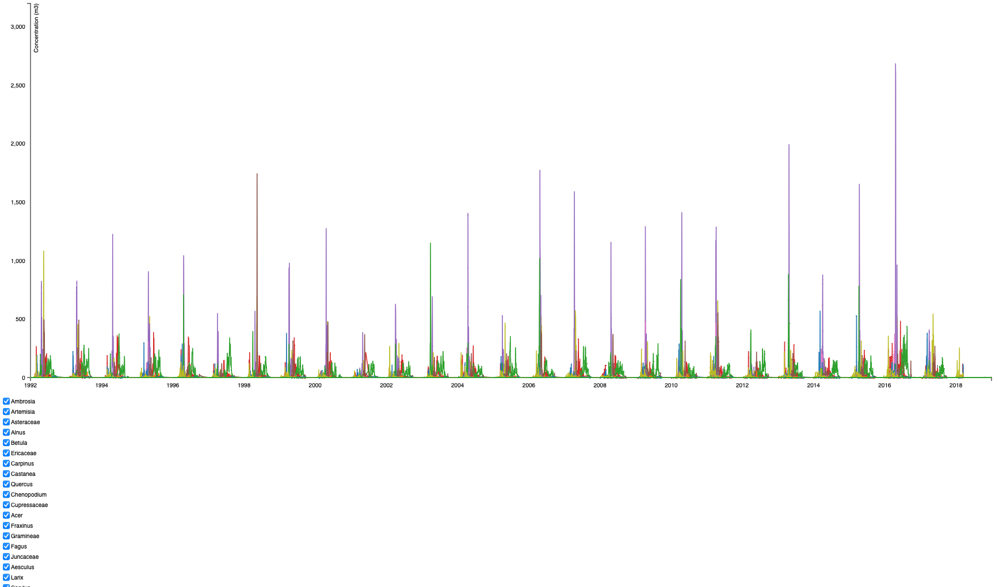

# Pollen-visualization
## Description
### Contexte de développement 
Ce projet a été développé dans le cadre du cours de _Visualisation de données_ dispensé par Isaac Pante (SLI, Lettres, UNIL) au semestre de printemps 2022.
### Visualisation
Visualisation des données de concentration pollinique au Luxembourg sur 26 ans, avec une trentaine de pollens répertoriés, ceci afin de pouvoir observer de potentielles variations de concentration pollinique selon les années.

Les données sont exprimées en pollens/m3. Pour se faire une idée du poids que peuvent représenter les valeurs, voir ce [tableau de la confédération suisse](https://www.meteoswiss.admin.ch/dam/jcr:f3d0942c-b3ab-4de6-882e-5df909faed9c/threshold-values-for-pollen-load-classes-of-allergenic-pollen-types.pdf) concernant les valeurs seuils pour les classes de charge pollinique des types de pollens allergisants. 

Il est possible de sélectionner les pollens désirés au moyen des checkboxes en dessous du graphique. 

### Accès aux données
Les données ont été récupérées sur la plateforme d'open data du Luxembourg, à l'adresse suivante : https://data.public.lu/en/datasets/pollen/ (dernière consultation le 19.12.2023). Les données sont disponibles au format CSV ou JSON. 
## Visualiser le projet
Pour accéder à la visualisation, cliquez [ici](https://jerchaumont.github.io/Pollen-visualization/).

Il est également possible de télécharger le dossier et de lancer le fichier `index.html` dans un serveur (par exemple avec l'extension [Live Server](https://marketplace.visualstudio.com/items?itemName=ritwickdey.LiveServer) sur Visual Studio Code).
## Outils utilisés
Utilisation de la librairie javascript [D3.js](https://d3js.org), qui permet des visualisations de données interactives dans un navigateur web. 

## Aides 
### Tutoriel Youtube
- "D3.js Multi-Series Line Chart", par Data Science Weekly : https://www.youtube.com/watch?v=jtVATktKAtM&list=PL4WVvNtU-vPAnqjTCN5_uVBFz5C3HvDck&index=8
### Aides sur Stack Overflow 
- Afficher de multiples variables : https://stackoverflow.com/questions/75686681/display-data-from-multiple-columns-from-a-csv-file-in-d3-js
- Ajout des checkboxes : https://stackoverflow.com/questions/77336948/how-to-hide-show-specific-lines-with-a-checkbox-on-a-line-chart 

## Améliorations possibles
Voir la section [_issues_](https://github.com/jerchaumont/Pollen-visualization/issues) du Github

## Carnet de bord
### 2022.05.19
- Recherches d'idées et de sets de données. 
- Jouer avec les données, nettoyer les données, différents tests.
- Comprendre comment faire une échelle et une _line chart_.

### 2022.05.27
- test des données sur un graphique axial.

### 2022.06
- Problèmes avec le _parsing_ des données, constamment la même erreur : `Error: Problem parsing d="MNaN,NaNLNaN,NaNLNaN,NaNLNaN,NaN"`. Impossible d'afficher toutes les variables polliniques en même temps. 

### 2023.03
- Reprise du projet, toujours le problème de parsing.

### 2023.12
- Reprise du projet. Problème de parsing résolu.
- Ajout des checkboxes.
- Finalisation du projet (Readme, Github Pages).  

